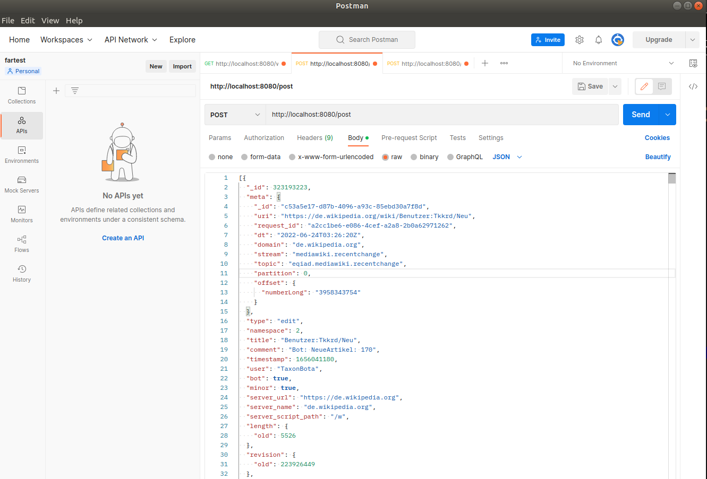

# pocALZ

## discription :
the project contains two independent modules:
1. the kafkaProducer Service module takes care of creating topics and writing it in the input topic (send the wikiChange.json file attached to the project)
2. the second streamfilterservice module takes care of ingesting in real time the data introduced in the first module and creates four output topics .
 
 

[//]: # (![mon image]&#40;images/gr1.png&#41;)
## needed tools:
1. Docker (and docker-compose)
2. Java
3. Kafka
## how to use :
### 1. build services locally:
build services:zookeeper kafka brocker :
  _docker-compose up -d_
 
### 2. send data:
1. starts services(run main classes: _StreamApplication_ and _ProducerServiceApplication_)
2. send data given in _wikiChange.json_ file: 
   in postmen: copy past, post method, url: http://localhost:8080/post, send.
 
 

## results:
*  the input topic is created and fed (module kafkaProducerService).  
* the data of the input topic are ingested: four topics are created and fed in real time containing data filtered from the data of the input topic.